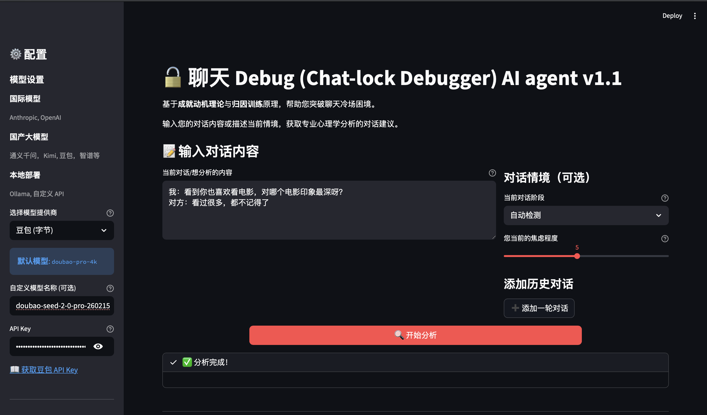
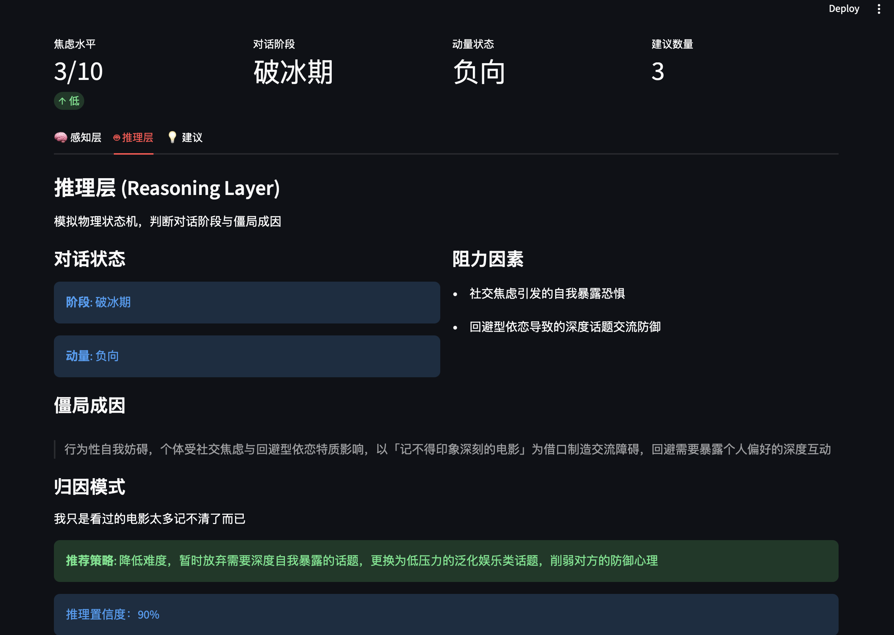
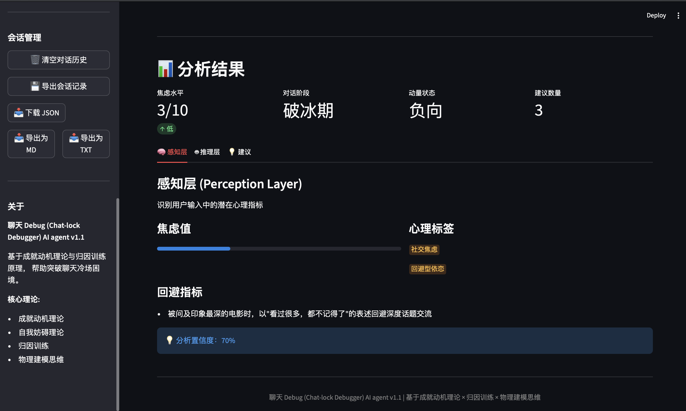
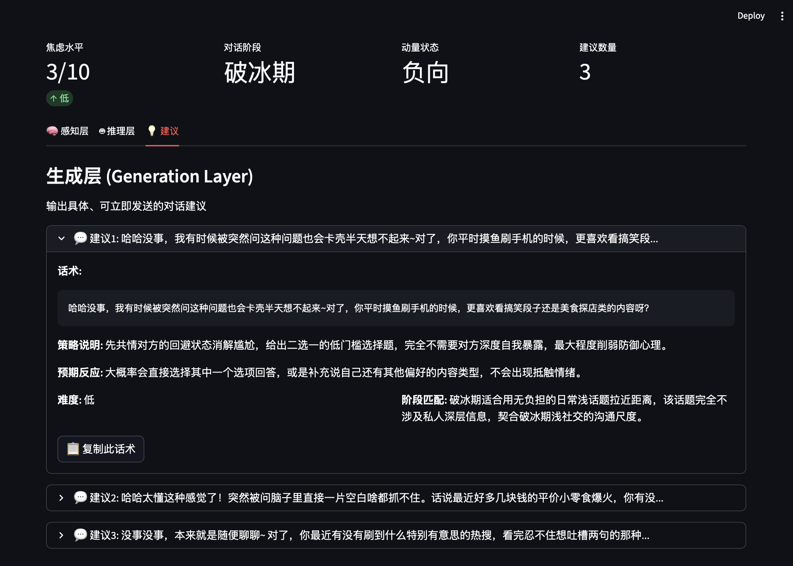
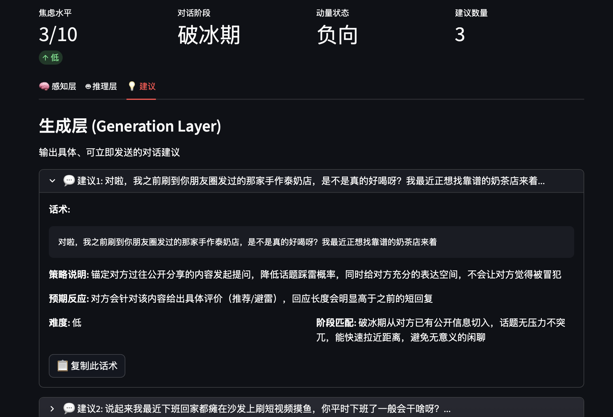
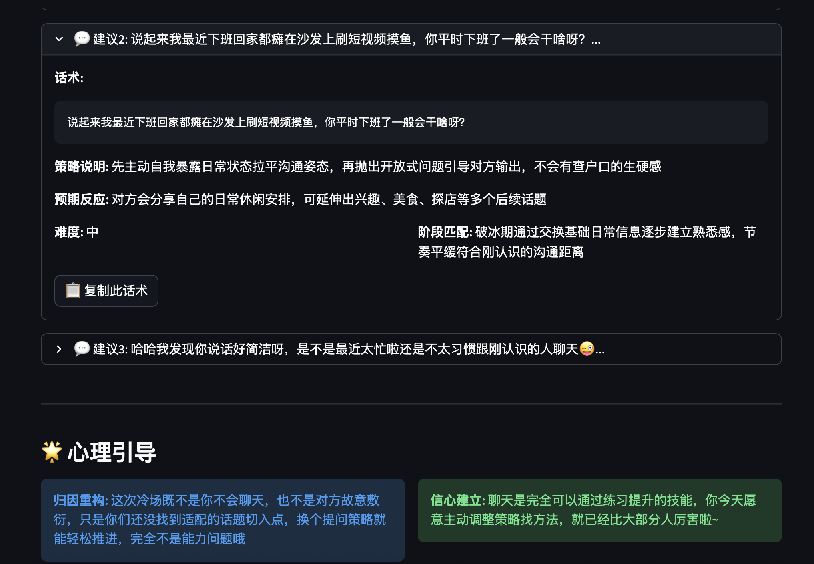

# 校园 BBS 推荐帖：聊天 Debug AI Agent

---

## 标题方案（3 选 1）

### 方案一【硬核技术型】
> 浙大学子自研「聊天 Debug 神器」！三层架构 + 心理学理论，专治各种不会聊天

### 方案二【福利工具型】
> 免费开源！本地部署的 AI 聊天军师，10+ 大模型随便选，脱单必备神器

### 方案三【幽默调侃型】
> 把天聊死有救了！学长用成就动机理论做了个 AI，分析完我的聊天记录它说：还有救（不是）

---

## 正文

### 【痛点直击】

兄弟们，有没有过这种经历：

- 匹配到心动 TA，憋了半小时打出一句"在吗"，然后…就没然后了
- TA 回复"在忙"，你傻等一晚上，最后朋友圈看到 TA 给别人点赞
- 好不容易聊上几句，突然冷场，空气凝固得能用脚抠出三室一厅
- 每次把天聊死之后，躺在床上复盘：当时我要是这么说就好了！

别慌，你不是一个人。今天给大家安利一个**由咱们学生自己开发的开源神器**——**聊天 Debug (Chat-lock Debugger) AI Agent v1.1**

---

### 【神器现身】

这可不是那种"AI 帮你回复"的智商税软件，而是一个**基于心理学理论的聊天分析工具**。

它的核心理论包括：
- **成就动机理论**：把聊天当成可以练习的技能，而不是看天赋
- **归因训练**：帮你分析冷场的真正原因，而不是无脑怪自己"不会聊"
- **物理建模思维**：用"动量""阻力"的概念理解对话走向

简单说，它就像一个**懂心理学的军师**，帮你分析局势、出谋划策，但具体怎么打，还得看你自己！

---

### 【图文并茂】

来几张界面图感受一下：

**主界面 - 简洁清爽，模型随便选**


**感知层分析 - 你的焦虑它懂**


**推理层分析 - 像 debugging 一样分析对话**


**生成层 - 直接给你可复制的话术**




---

### 【核心亮点】

- **三层分析架构**：感知层（识别你的焦虑）→ 推理层（分析对话阶段）→ 生成层（给出具体话术），科学拆解，不是瞎编

- **10+ 大模型支持**：Qwen（通义千问）、Kimi（月之暗面）、DeepSeek、豆包、Claude、GPT-4…想换就换，总有一款适合你

- **完全免费开源**：代码透明，本地部署，隐私安全。用 Ollama 本地跑开源模型，连 API Key 都省了

- **双重界面**：喜欢图形界面？Streamlit Web 端安排；喜欢命令行？CLI 工具满足你

- **报告导出功能**：分析完可以导出 MD/TXT 格式，方便复盘和分享给好基友

---

### 【快速上手】

#### 方式一：Web 界面（推荐新手）

```bash
# 1. 克隆项目
git clone <项目地址>
cd ai_date_with_ta

# 2. 安装依赖
python -m venv venv
source venv/bin/activate  # macOS/Linux
pip install -r requirements.txt

# 3. 配置 API Key（以 Qwen 为例）
python cli.py config --provider qwen --api-key YOUR_DASHSCOPE_KEY

# 4. 启动 Web 界面
streamlit run main.py
```

然后浏览器打开 `http://localhost:8501`，就能看到上面的界面了！

#### 方式二：命令行（极客最爱）

```bash
# 快速分析
python cli.py quick --text "TA 回复好冷淡，我该怎么办"

# 完整分析
python cli.py analyze --text "刚匹配到喜欢的人，不知道该怎么开场" --provider kimi

# 导出报告
python cli.py analyze --text "..." --export report.md
```

---

### 【写在最后】

这个项目是学长自己在社交中遇到困境后，结合心理学理论开发的。目前还在持续迭代中～

**项目地址**：[GitHub 仓库]（可以把你的 repo 链接放这里）

**欢迎**：
- Star 支持一下
- 提 Issue 反馈问题
- 一起贡献代码
- 或者单纯来聊聊使用体验

最后，祝大家都能成为聊天高手，早日脱单！

---

<p align="center">
<b>聊天 Debug (Chat-lock Debugger) AI Agent v1.1</b><br/>
基于成就动机理论 × 归因训练 × 物理建模思维
</p>
